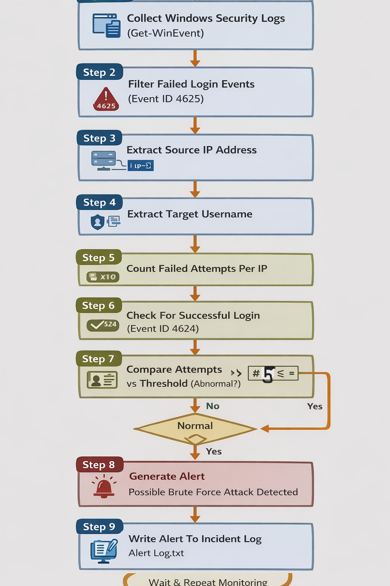
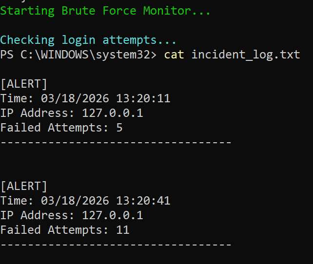

#  Real-Time Brute Force Detection using PowerShell

##  Overview

Brute force attacks are one of the most common techniques used to gain unauthorized access by repeatedly trying different password combinations.

This project demonstrates how to **detect brute force login attempts in real time** using **Windows Security Event Logs and PowerShell**.

The system monitors failed login attempts, identifies suspicious patterns, and generates alerts when a threshold is exceeded.

---

##  Features

*  Detects failed login attempts (Event ID 4625)
*  Extracts **source IP address**
*  Tracks **target usernames**
*  Counts repeated attempts per IP
*  Real-time monitoring using continuous loop
*  Reduces false positives using successful login checks (Event ID 4624)
*  Logs incidents into a file for investigation

---

##  Technologies Used

* PowerShell
* Windows Event Viewer
* Windows Security Logs

---

##  Detection Logic

A brute force attack typically looks like:

* Multiple failed login attempts
* From the same IP address
* Within a short time

### Detection Rule:

If:

* Failed attempts ≥ Threshold
* AND no successful login

 Then: **Possible brute force attack**

---

##  Event IDs Used

| Event ID | Description      |
| -------- | ---------------- |
| 4625     | Failed Login     |
| 4624     | Successful Login |
| 4740     | Account Lockout  |

---

##  How It Works

1. Collect Windows Security Logs
2. Filter failed login events (4625)
3. Extract IP address & username
4. Count attempts per IP
5. Check threshold
6. Verify no successful login
7. Generate alert
8. Store alert in log file

---

##  Usage

### Run the script:

```powershell
.\script.ps1
```

##  Detection Pipeline




##  Log File Example (Output)

```
[ALERT]
Time: 2026-03-18 11:20
IP Address: 192.168.1.10
Target Username: Administrator
Failed Attempts: 12
----------------------------------
```

---

##  Output



##  Project Structure

```
BruteForceDetection/
│
├── script.ps1
├── README.md
├── screenshots/
│   └── output.png
├── diagrams/
│   └── pipeline.png
```

---

##  Learning Outcomes

* Windows Event Log Analysis
* Detection Engineering Concepts
* PowerShell Automation
* Security Monitoring Techniques
* Real-time Threat Detection

---

##  Note

This project is built for **educational and defensive security purposes only**.

---

##  Author

**Farha Mustafi**
